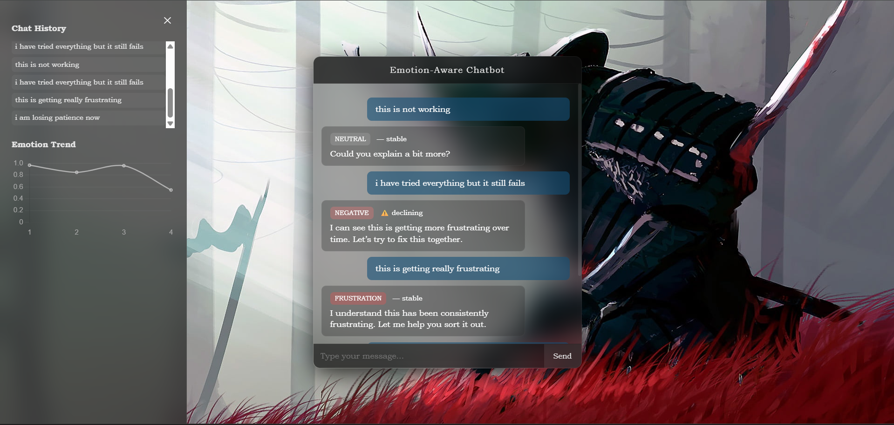
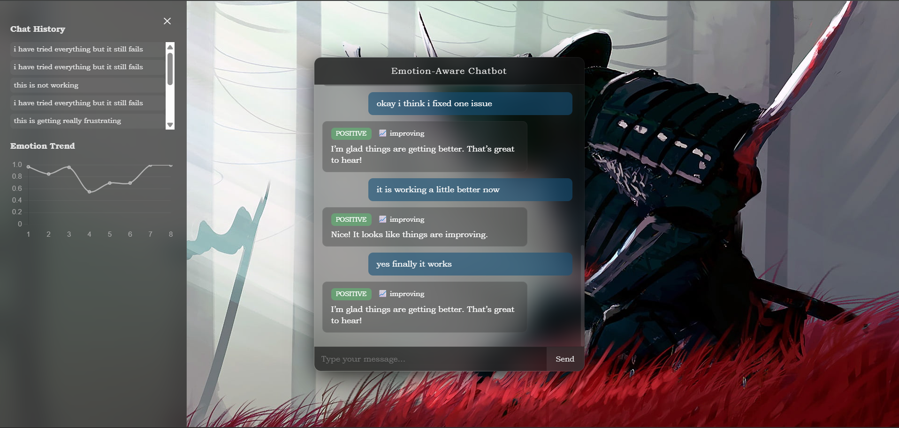

# 🧠 Narrative-Aware Emotion Classification & Chatbot System
An AI-powered system for narrative-aware emotion classification, with a lightweight chatbot interface for real-time demonstration.
---

# 📌 1. Introduction — What is this project?

This project focuses on building an **emotion-aware conversational system** that goes beyond traditional text-based emotion classification.

Most existing models analyze emotions **sentence-by-sentence**, treating each input independently.

However, real human conversations are **continuous narratives**, where emotions evolve over time.

👉 This project aims to bridge that gap by introducing:

- Narrative-aware emotion understanding  
- Temporal emotion tracking  
- Real-time conversational interaction  

---

# 🎯 2. Intent & Motivation — Why this project?

In real-world applications like:

- Customer support  
- Mental health systems  
- AI assistants  

Understanding **how emotions change over time** is more important than detecting emotion in a single sentence.

Traditional systems:
- Detect emotion per message ❌  
- Ignore emotional progression ❌  

Our goal:
> To build a system that understands **emotional flow across a conversation** and responds accordingly.

## ⚠️ Note on Chatbot Interface

The chatbot UI in this project is designed as a **demonstration layer** to showcase the system’s capabilities.

The primary focus of the project is:

- Emotion classification
- Narrative-aware modeling
- Temporal emotion tracking

The chatbot is not intended to be a fully developed conversational agent, but rather a way to visualize:

- Emotion predictions  
- Trend detection  
- System behavior in real time  

---

---

# 🔍 3. Previous Work

We began with a standard approach:

### ✅ Baseline Model
- RoBERTa-based emotion classifier  
- Multi-label classification using GoEmotions dataset  

### 🔥 Hybrid Model
- Combined:
  - RoBERTa embeddings  
  - Narrative features (polarity, volatility, dominant emotion)

### 📊 Observation

| Model | Macro F1 |
|------|---------|
| RoBERTa | 0.515 |
| Hybrid | 0.51 |

👉 Insight:
- Transformer models already capture strong contextual signals  
- Simple narrative features were not enough to improve performance  

This led to a key realization:

> Emotion modeling requires **temporal understanding**, not just static features.

---

# 🌍 4. Where can this be used?

This system can be applied in:

- 💬 Customer Support Chatbots  
- 🧠 Mental Health Assistants  
- 🤖 AI Companions  
- 🎮 Game AI (emotion-aware NPCs)  
- 📊 Sentiment Tracking Systems  

---

# ⚙️ 5. Approach — How we built this system

We moved from **static classification → dynamic conversational system**

---

## 🧩 Core Components

### 1. Emotion Classification (RoBERTa)
- Extracts contextual emotional meaning from text

### 2. Narrative Features
- Polarity (positive / negative / neutral)
- Emotion dominance
- Volatility

### 3. Temporal Modeling (LSTM)
- Captures emotion progression across multiple messages

### 4. Trend Analyzer
- Determines:
  - Improving 📈  
  - Declining ⚠️  
  - Stable ➖  

### 5. Response Generator
- Maps emotional state → contextual response

### 6. UI Layer (Frontend)
- Real-time chat interface  
- Typing animation  
- Emotion badges  
- Trend indicators  
- Graph + history panel (toggle-based)

---

# 🧩 6. Project Journey (Phases & Decisions)

---

## 🟢 Phase 0 — Setup
- Created project structure  
- Set up environment  
- Initialized GitHub  

---

## 🟢 Phase 1 — Baseline Model
- Implemented RoBERTa classifier  
- Used CLS token representation  

👉 Decision:
Start with strong baseline before experimenting  

---

## 🟢 Phase 2 — Data Pipeline
- Tokenization using HuggingFace  
- Multi-label encoding  

👉 Decision:
Maintain consistency with dataset for fair comparison  

---

## 🟢 Phase 3 — Narrative Features
- Designed features:
  - Polarity  
  - Volatility  
  - Dominant emotion  

👉 Challenge:
Features were not directly usable in real-time  

---

## 🟢 Phase 4 — Hybrid Model
- Combined text + narrative features  

👉 Result:
No significant improvement  

👉 Insight:
Feature design alone is not enough  

---

## 🟢 Phase 5 — Training Pipeline
- BCEWithLogitsLoss  
- AdamW optimizer  
- Macro F1 evaluation  

---

## 🟢 Phase 6 — Model Comparison
- Compared baseline vs hybrid  

👉 Key Learning:
> Transformers already encode strong contextual signals  

---

## 🔥 Phase 7–10 — System Transformation

Shifted from **model → system thinking**

Added:

- Emotion mapping (human-readable categories)  
- Conversation memory  
- Trend analysis logic  
- Response generation  

👉 Major Shift:
From classification → **interaction**

---

## 🚀 Phase 11 — UI & Product Layer

Built a complete frontend:

- Chat interface  
- Typing animation  
- Emotion badges  
- Trend indicators  
- Glassmorphism design  
- Toggle panel for:
  - Emotion graph  
  - Chat history  

👉 Outcome:
> Transformed project into a **real-time AI product**


---

## 🧩 Project Structure

```
Narrative-Emotion-Classifier/
│
├── src/
│   ├── api.py                  # Flask backend (main entry point)
│   ├── model.py                # Baseline RoBERTa model
│   ├── hybrid_model.py         # Hybrid model (RoBERTa + features)
│   ├── data_loader.py          # Dataset loading & preprocessing
│   ├── narrative_features.py   # Narrative feature extraction
│   ├── train.py                # Training pipeline for models
│   │
│   ├── emotion_mapper.py       # Maps model output → readable emotion
│   ├── conversation_memory.py  # Stores conversation history
│   ├── trend_analyzer.py       # Detects emotion trend (📈 / ⚠️)
│   ├── response_generator.py   # Generates contextual responses
│   │
│   ├── lstm_model.py           # LSTM for temporal modeling
│   ├── lstm_features.py        # Feature prep for LSTM
│   ├── lstm_data.py            # LSTM dataset processing
│   ├── train_lstm.py           # LSTM training script
│   │
│   ├── static/
│   │   ├── style.css           # UI styling (glassmorphism)
│   │   ├── script.js           # Frontend logic (chat + graph)
│   │
│   ├── templates/
│   │   └── index.html          # Chat UI layout
│   │
│   └── test_response.py        # Testing response pipeline
│
├── models/                     # Saved model weights (.pt files)
├── README.md
└── requirements.txt
```
---

---

## ❌ 2. "Key File Responsibilities" looks messy

Right now it’s like plain text → not readable

---

## ✅ FIX (clean version)

Replace that entire section with:

```md
## 📂 Key File Responsibilities

### 🔹 Backend Core

- **api.py**  
  Main Flask server connecting UI with AI pipeline  

- **trend_analyzer.py**  
  Detects emotional progression (📈 / ⚠️ / ➖)  

- **response_generator.py**  
  Generates contextual responses based on emotion  

---

### 🔹 AI / ML Layer

- **model.py**  
  Baseline RoBERTa classifier  

- **hybrid_model.py**  
  Combines text + narrative features  

- **lstm_model.py**  
  Captures temporal emotion flow  

---

### 🔹 Narrative Intelligence

- **emotion_mapper.py**  
  Converts model outputs to readable emotion labels  

- **conversation_memory.py**  
  Maintains conversation context  

---

### 🔹 Frontend (UI Layer)

- **index.html**  
  Chat interface  

- **style.css**  
  Glass UI design  

- **script.js**  
  Handles:
  - Chat interaction  
  - Typing animation  
  - Emotion badges  
  - Trend display  
  - Graph + history panel  

---

### 🔹 Training & Data

- **train.py**  
  Baseline + hybrid training  

- **train_lstm.py**  
  Temporal model training  

- **data_loader.py**  
  Dataset preprocessing  

---

# 🎮 7. How to Use the System

Run:

```bash
python src/api.py

Open in browser:

http://127.0.0.1:5000/ui
---

🧪 Example Interaction
this is not working
still broken
this is getting worse

👉 System detects:

Emotion → frustration
Trend → ⚠️ declining

Then:

okay it is better now
yes it works
great it is fixed

👉 System detects:

Trend → 📈 improving

##📊 8. Features Summary
Emotion classification (RoBERTa)
Narrative-aware features
LSTM temporal modeling
Emotion trend detection
Real-time chat UI
Emotion badges
Typing animation
Graph visualization
Chat history panel

## 📸 Demo

### 🔻 Declining Emotion (Frustration Build-up)



---

### 📈 Improving Emotion (Recovery Phase)



---

### 🔄 Mixed Emotion (Confusion → Understanding)


##🧠 9. Key Learnings
Emotion is not static — it evolves
Transformers are strong, but lack explicit temporal reasoning
System design matters as much as model design

##⚠️ 10. Limitations
Trend logic is rule-based
LSTM can be improved further
No backend database (uses local storage)

##🚀 11. Future Improvements
Multi-chat sessions (like ChatGPT)
Database integration
Better temporal modeling
Deployment as web app
Improved emotion calibration
Advanced UI enhancements
LLM integration 

🤝 Contributions

Open to feedback, suggestions, and collaboration.